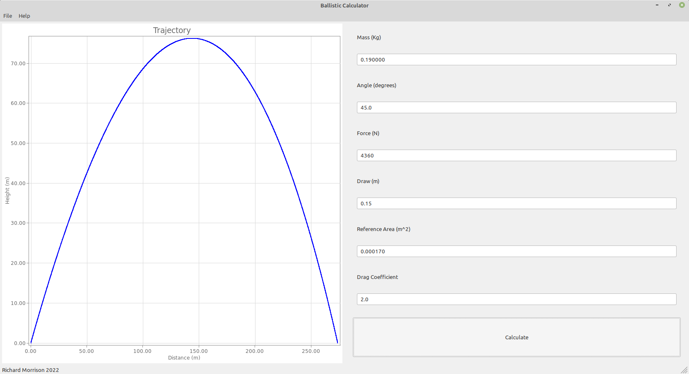

# Projectile

## Background

This code originally started late on a Saturday night after I'd been browsing YouTube. Jason Kingsley from Modern History TV was having fun with a crossbow, experimenting with how far he could fire a bolt with a medieval crossbow. (See https://youtu.be/T-ONNJ4HIIE .) I put some C++ code together to see if I could get a similar result numerically. My code was (and remains), frankly, messy. I think I can do a better job with the inheritance model for the state class associated with the system of differential equations.

Some weeks later, I decided to have a play with wxWidgets and wxFreeChart. I'd never used these frameworks before, and I wanted to explore. I wanted to process an input, produce a graphical output, and update those graphics on a repeat calculation. I wanted to see if I could extend and aggregate the wxWidgets classes (I've created a labelled text box class and an input panel) and I wanted to see if I could extend some wxFreeChart objects into a standard graph object, that could be refreshed/updated. The result is the code included here.

## Status of code

I've not built a proper makefile, I've just got a single compile command in a shell script (compile.sh). If I wanted to turn this into a maintainable project (I don't), I'd probably fix this first. (However, I might slowly build up a library of objects built from wxFreeChart for my casual use.) The script can be trivially modified to point to installed or locally compiled wxWidgets and wxFreeChart installations. I think it can be compiled in windows without too much of a problem.

## Thoughts on wxWidgets & wxFreeChart

Over time I've tried to evolve my coding style in C++ to not use pointers too heavily, other than for some semantic clues, as recommended by Stroustrup. (There is nothing wrong with pointers, but I'm finding them increasingly unnecessary depending on coding style.) WxWidgets requires the use of pointers, and this means my code mixes coding styles, which I don't like. With these frameworks I find it diffucult to feel confident I've not introduced any memory leaks. I gather wxWidgets and wxFreeChart handle memory cleanup on close for components registered in the GUI tree. Valgrind doesn't seem to behave with these libraries, so it's hard to know. I plan to explore design options to approximate data bindings, to properly separate architectural components.

## How this calculates

The function release_bolt assumes that the force-extension curve of the crossbow is linear, and takes the work done on the bolt to be half the product of the max force applied with distance (the area of the triangle). From here we calculate an initial velocity, the components of which are resoled from the launch angle.  The code contains a very simple templated Runge-Kutta implementation, which progresses the projectile through time. A simple drag coefficient model is used ( https://en.wikipedia.org/wiki/Drag_coefficient ), and the code assumes that the reference area remains constant (no tumbling). The state is iterated until the projectile height return to zero.

## Back to Crossbows

In his video, Jason Kingsley notes:

- The crossbow requires about 980 lb of force to draw, or about 4360 N. I will take this to be the ultimate force applied at the end of extension.
- The crossbow is drawn a distance of about 5.5 - 6.0 inches, or about 15 cm.
- The crossbow bolt is about 190 grams.
- The bolt appears to have a diameter of a little over 1 cm. I assume the fletching also increases the *effective* reference drag area, and take the area to be 1.7 cm^2, or 0.00017 m^2.
- The drag coefficient is difficult. I've seen papers quoting quite highh coefficient of drag values. I take it to be 2.0.
- The bolt is launched at 45 degrees.

Plugging these into my solver, we find a range of about 275 metres.

